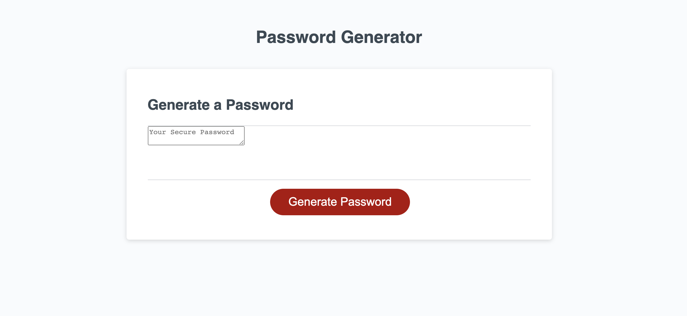

# passwordHW

## Table of Contents

* [Description](#Description)
* [Challenges](#Challenges)
* [Tools](#Tools)

## Description 

This Assignment was really challenging I had to learn how to use JavaScript to assign functions, Eventlisteners, and many more terms that were new to me to my application. I had a lot of fun creating this password generator because I was able to put to use some of the things that we have learn in class into one project.

https://juan8389.github.io/passwordHW/
 

## Challenges

This assignment was challenging and fun. This homework used Javascript, HTML, and CSS. I was able to research and develop this application.

## Tools 

I used tutoring, getbootstrap and W3schools most important my notes and class work.
